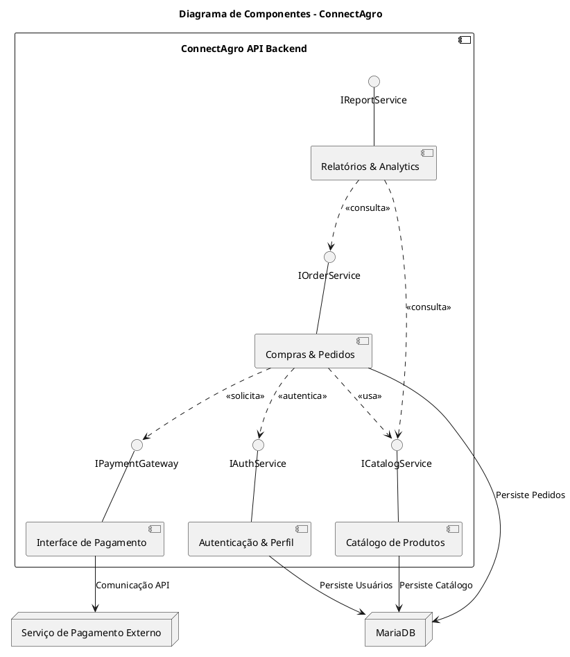

```plantuml

@startuml
title Diagrama de Componentes - ConnectAgro

component "ConnectAgro API Backend" {

    ' Definição dos Componentes
    component [Autenticação & Perfil] as Auth
    component [Catálogo de Produtos] as Catalog
    component [Compras & Pedidos] as Orders
    component [Relatórios & Analytics] as Reports
    component [Interface de Pagamento] as PaymentInterface

    ' Definição das Interfaces 
    interface "IAuthService" as auth_iface
    interface "ICatalogService" as catalog_iface
    interface "IOrderService" as order_iface
    interface "IReportService" as report_iface
    interface "IPaymentGateway" as payment_iface

    ' Conexão Componente <-> Interface
    Auth -up- auth_iface
    Catalog -up- catalog_iface
    Orders -up- order_iface
    Reports -up- report_iface
    PaymentInterface -up- payment_iface
}

' NÓS DE INFRAESTRUTURA
node "MariaDB" as db
node "Serviço de Pagamento Externo" as external_payment


Orders ..> catalog_iface : <<usa>>
Orders ..> payment_iface : <<solicita>>
Reports ..> catalog_iface : <<consulta>>
Reports ..> order_iface : <<consulta>>
Orders ..> auth_iface : <<autentica>>

' Dependências de Infraestrutura 
Auth --> db : Persiste Usuários
Catalog --> db : Persiste Catálogo
Orders --> db : Persiste Pedidos

' Dependências Externas
PaymentInterface --> external_payment : Comunicação API
@enduml

```
