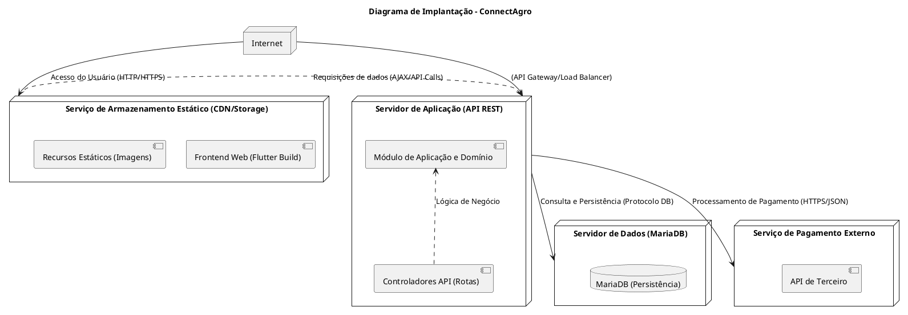

```plantuml

@startuml
title Diagrama de Implantação - ConnectAgro

node "Internet" as internet

' NÓS DE INFRAESTRUTURA

node "Serviço de Armazenamento Estático (CDN/Storage)" as cdn {
    component "Frontend Web (Flutter Build)" as ui_web
    component "Recursos Estáticos (Imagens)" as assets
}

node "Servidor de Aplicação (API REST)" as backend {
    component "Módulo de Aplicação e Domínio" as app_domain
    component "Controladores API (Rotas)" as api_controller
}

node "Servidor de Dados (MariaDB)" as db {
    database "MariaDB (Persistência)" as mariadb
}

node "Serviço de Pagamento Externo" as payment_service {
    component "API de Terceiro" as third_api
}

' CONEXÕES

internet --> cdn : Acesso do Usuário (HTTP/HTTPS)
internet --> backend : (API Gateway/Load Balancer)

cdn .> backend : Requisições de dados (AJAX/API Calls)

backend --> db : Consulta e Persistência (Protocolo DB)
backend --> payment_service : Processamento de Pagamento (HTTPS/JSON)

app_domain -[hidden]right-> api_controller
api_controller ..> app_domain : Lógica de Negócio

@enduml

```
