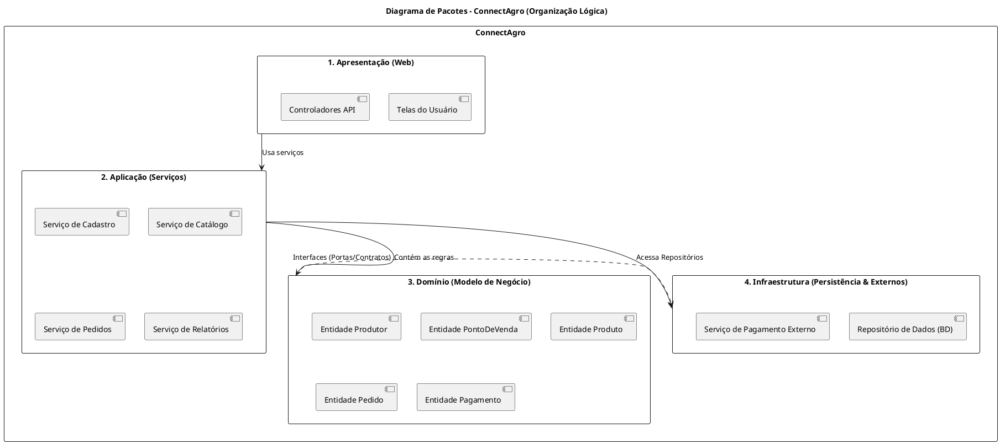

```plantuml

@startuml
skinparam packageStyle rectangle

title Diagrama de Pacotes - ConnectAgro (Organização Lógica)

package "ConnectAgro" {

    package "1. Apresentação (Web)" {
        [Telas do Usuário]
        [Controladores API]
    }

    package "2. Aplicação (Serviços)" {
        [Serviço de Cadastro]
        [Serviço de Catálogo]
        [Serviço de Pedidos]
        [Serviço de Relatórios]
    }

    package "3. Domínio (Modelo de Negócio)" {
        [Entidade Produtor]
        [Entidade PontoDeVenda]
        [Entidade Produto]
        [Entidade Pedido]
        [Entidade Pagamento]
    }

    package "4. Infraestrutura (Persistência & Externos)" {
        [Repositório de Dados (BD)]
        [Serviço de Pagamento Externo]
    }
}

' Relações de Dependência: As dependências apontam para o centro/domínio (Camada > Camada abaixo)

"1. Apresentação (Web)" --> "2. Aplicação (Serviços)" : Usa serviços

"2. Aplicação (Serviços)" --> "3. Domínio (Modelo de Negócio)" : Contém as regras

"2. Aplicação (Serviços)" --> "4. Infraestrutura (Persistência & Externos)" : Acessa Repositórios

"3. Domínio (Modelo de Negócio)" .> "4. Infraestrutura (Persistência & Externos)" : Interfaces (Portas/Contratos)

@enduml

```
